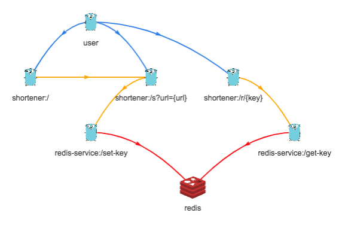

# Gopher Laboratory 

## Use Case

Build a service that acts as a HTTP Proxy for a redis instance - - > redis-service

Build a simple app that make use of the redis-service - - > url-shortener

### redis-service [@kitz99](https://github.com/kitz99)

 { insert description here }

### url-shortener [@ionutvilie](https://github.com/ionutvilie)

root path (not in the scope):

- register http file server with a static index.html page
- html uses js + axios to communicate with the shortener path

shortener path:

- requestor sends long URL to the service
- url it is hashed with adler32 checksum algorithm
- hash and url are sent to the storage service as key - value
- short URL is sent to to requestor

redirect path

- key is received by the redirect handler
- storage service is contacted with the key in order to get the original URL
- user is redirected to the original URL

## Prerequisites:

1) [Go Lang](https://golang.org/dl/)
1) Text editor: recommended [vscode](https://code.visualstudio.com/)
1) If you choose to use vscode, the recommendation is to install
    - AtomKeyMap
    - Bracket Pair Colorizer
    - Go
1) A running instance of Redis server [version 4.0](https://redis.io/download) or Docker.

Please install this prerequisites on your machines before the workshop to be sure everything will work fine.

